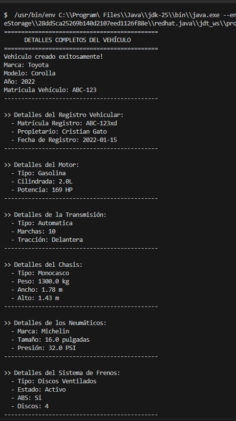
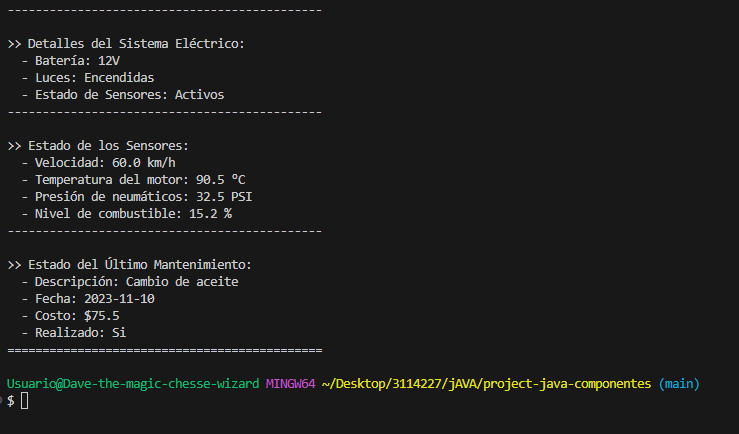

# project-java-componentes

## Diagrama de Clases

El proyecto está estructurado alrededor de la clase `Vehiculo`, que actúa como un contenedor principal para varios componentes que representan las partes de un vehículo. La relación principal es de **Composición**, donde el `Vehiculo` "tiene" o está "compuesto por" otros objetos.

### Jerarquía y Relaciones

- **`App`**: Es la clase principal que contiene el método `main`. Su función es instanciar un objeto `Vehiculo` y todos sus componentes, configurarlos y mostrar la información. Depende de todas las demás clases.

- **`Vehiculo`**: Es la clase central del modelo.
    - **Atributos propios**: `marca`, `modelo`, `matricula`, `anio`.
    - **Componentes (Composición)**: Contiene una instancia de cada una de las siguientes clases:
        - `Motor`: Representa el motor del vehículo.
        - `Transmision`: Describe el sistema de transmisión.
        - `Chasis`: Contiene información sobre el chasis.
        - `Neumatico`: Representa las llantas.
        - `SistemaFrenos`: Describe el sistema de frenos.
        - `SistemaElectrico`: Modela el sistema eléctrico.
        - `RegistroVehicular`: Almacena los datos de registro legal.
        - `Mantenimiento`: Guarda el historial de mantenimiento.
        - `Sensor`: Agrega los datos de los sensores del vehículo.

### Descripción de las Clases Componente

- **`Motor`**: Características técnicas del motor (tipo, cilindrada, potencia).
- **`Transmision`**: Tipo de transmisión, número de marchas y tipo de tracción.
- **`Chasis`**: Tipo de chasis, peso y dimensiones (ancho, largo, alto).
- **`Neumatico`**: Marca, tamaño y presión de los neumáticos.
- **`SistemaFrenos`**: Tipo de frenos, estado, si tiene ABS y número de discos.
- **`SistemaElectrico`**: Voltaje de la batería, estado de las luces y sensores.
- **`RegistroVehicular`**: Matrícula, propietario y fecha de registro.
- **`Mantenimiento`**: Descripción, fecha, costo y estado de un mantenimiento.
- **`Sensor`**: Lecturas de sensores como velocidad, temperatura, presión y nivel de combustible.

En resumen, la clase `Vehiculo` es un agregado de todas las demás clases (excepto `App`), que modelan sus diferentes partes y aspectos. La clase `App` orquesta la creación y visualización de un objeto `Vehiculo` completo.

## Capturas de pantalla

